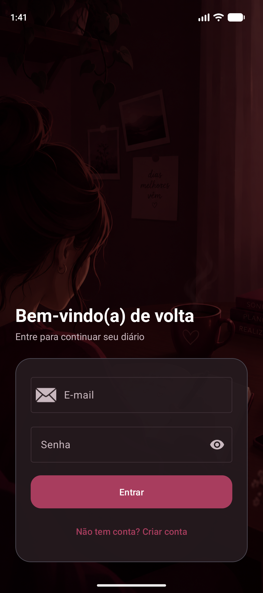
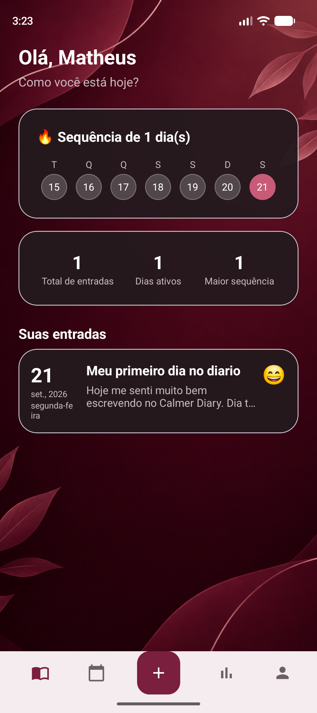
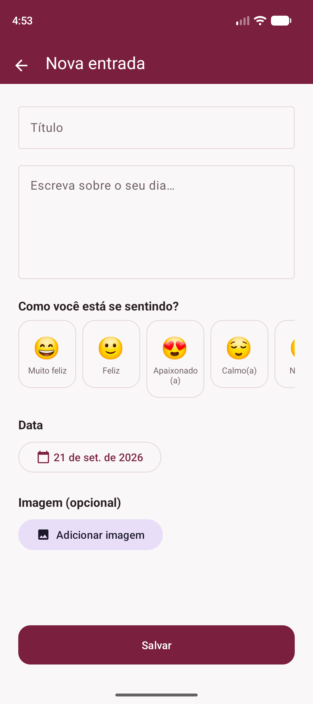
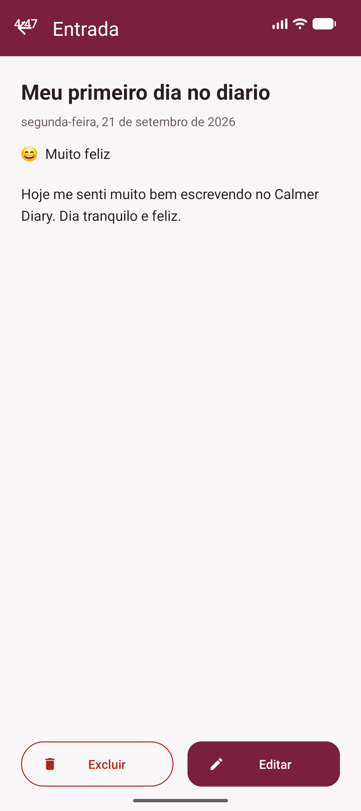
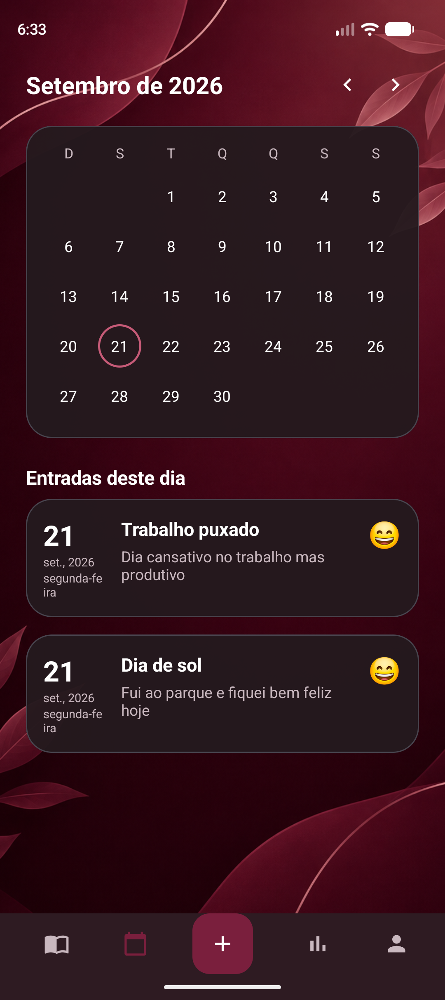
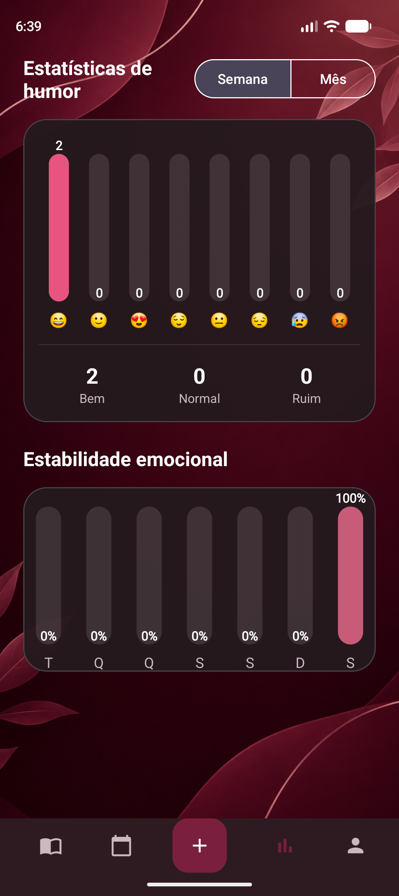
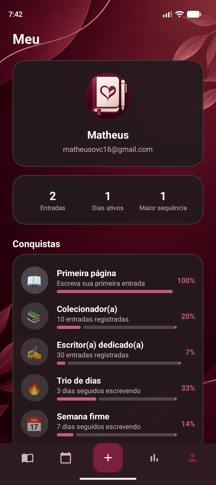
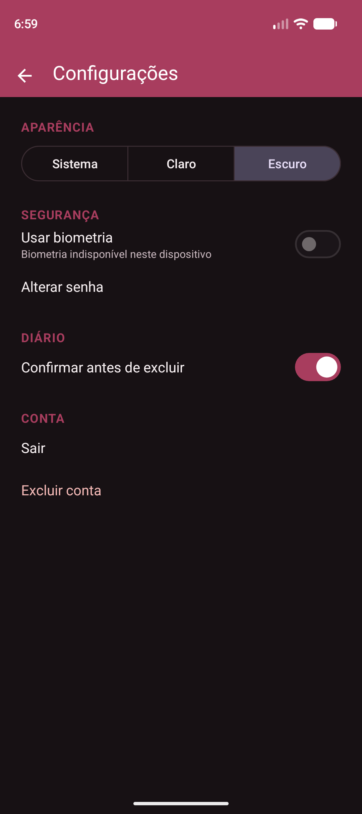
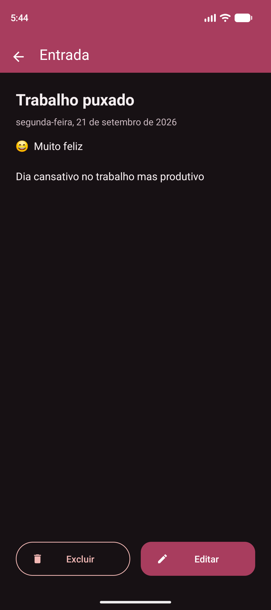

<h1 align="center">🍷 Calmer Diary</h1>

<p align="center">
  <strong>Seu diário, seu refúgio.</strong><br>
  Aplicativo Android nativo de diário pessoal — privado, elegante e acolhedor, com identidade visual em tons de vinho/bordô.
</p>

<p align="center">
  
  
  
  
  
</p>

---

## 📖 Sobre o projeto

O **Calmer Diary** é um aplicativo mobile de diário pessoal que permite ao usuário registrar
pensamentos, sentimentos, lembranças e acontecimentos do dia a dia. Por serem informações
**pessoais e privadas**, o app protege o acesso com **senha (hash)** e, quando o aparelho
suporta, **biometria** — e mantém os dados de cada usuário totalmente isolados.

Projeto acadêmico da disciplina de **Desenvolvimento Mobile**, desenvolvido de forma nativa no
**Android Studio** com **Java + XML**, arquitetura **MVVM** e persistência com **Room**.

---

## ✨ Funcionalidades

Requisitos funcionais da documentação:

- ✅ **RF01 — Cadastro de usuário** (nome, e-mail, senha, com validações)
- ✅ **RF02 — Login e autenticação** (sessão persistida e segura)
- ✅ **RF03 — Criar, visualizar, editar e excluir** entradas do diário
- ✅ **RF04 — Pesquisar e filtrar** registros (por título/conteúdo e por dia/mês/ano) + **calendário**
- ✅ **RF05 — Proteção por senha e biometria** (quando disponível no aparelho)
- ✅ **RF06 — Persistência em banco de dados** (Room)

E vários extras:

- 🔥 **Sequência (streak)** e resumo de atividade
- 🎭 **Registro de humor** com seletor visual de emoções
- 📊 **Estatísticas de humor** e **estabilidade emocional** (gráficos desenhados no Canvas)
- 🗓️ **Calendário** com marcação dos dias que possuem entradas
- 🏆 **Conquistas** que se desbloqueiam automaticamente conforme o uso
- 👤 **Perfil** com estatísticas do usuário
- ⚙️ **Configurações** (tema, biometria, alterar senha, confirmar exclusão, excluir conta)
- ☀️🌙 **Modo claro e escuro** (Sistema / Claro / Escuro)
- 🖼️ **Imagem opcional** por entrada (galeria)
- 🧭 Navegação inferior com botão central de nova entrada
- 🔒 **Isolamento total dos dados por usuário**

---

## 📸 Capturas de tela

<p align="center">
  
  
  
</p>
<p align="center">
  
  
  
</p>
<p align="center">
  
  
  
</p>

---

## 🎨 Identidade visual

A paleta gira em torno do **vinho/bordô**, transmitindo algo elegante, acolhedor e pessoal:

| Uso | Cor | Hex |
|---|---|---|
| Primária | Vinho | `#7A1F3D` |
| Primária escura | Bordô | `#55152B` |
| Primária clara | Vinho suave | `#A83D5E` |
| Destaque | Rosé | `#C75B78` |
| Fundo (claro) | Off-white | `#FAF7F8` |
| Fundo (escuro) | Vinho quase preto | `#171114` |

---

## 🏗️ Arquitetura

O projeto segue o padrão **MVVM (Model–View–ViewModel)** com separação clara de responsabilidades:

```
View (Activities/Fragments)  ⇄  ViewModel (LiveData)  ⇄  Repository  ⇄  DAO (Room)  ⇄  SQLite
```

- **View** — telas e componentes; observam `LiveData` e não contêm regra de negócio.
- **ViewModel** — expõe estado observável e orquestra os repositórios.
- **Repository** — regras de negócio e acesso a dados (roda fora da main thread).
- **Room/DAO** — persistência local; todas as consultas filtradas por `userId`.

---

## 🗄️ Banco de dados (Room)

| Entidade | Descrição |
|---|---|
| `User` | Usuário (e-mail único, `passwordHash`, `salt`) |
| `DiaryEntry` | Entrada do diário (título, conteúdo, data, humor, imagem) |
| `MoodEntry` | Registro de humor (para estatísticas), em cascata com a entrada |
| `AppSettings` | Preferências por usuário (tema, biometria, confirmação de exclusão) |

As chaves estrangeiras usam **`ON DELETE CASCADE`**: excluir um usuário remove
automaticamente todas as suas entradas e humores.

---

## 🔐 Segurança e privacidade

- Senhas **nunca** são armazenadas em texto puro — apenas **hash PBKDF2 (HMAC-SHA256)** com **salt** por usuário.
- Sessão guardada em **`EncryptedSharedPreferences`**.
- **Autenticação biométrica** via `androidx.biometric` (com verificação de disponibilidade e fallback para senha).
- **Isolamento por usuário**: todas as consultas usam `WHERE userId = :currentUserId`.

---

## 🛠️ Tecnologias

- **Java** + **XML** (Android SDK nativo)
- **Room** (persistência) · **LiveData / ViewModel** (arquitetura)
- **Material Components 3** · **ConstraintLayout** · **RecyclerView**
- **androidx.biometric** · **androidx.security-crypto**
- Gráficos com **Canvas** (custom views — sem bibliotecas externas)

---

## 📋 Requisitos

- **Android Studio** (versão recente)
- **JDK 17** (o JBR que acompanha o Android Studio já serve)
- **Android SDK** com a plataforma de API compatível instalada
- Um **dispositivo físico** ou **emulador** com **Android 8.0 (API 26)** ou superior

---

## 🚀 Como abrir, compilar e executar

### Opção A — Android Studio (recomendado)

1. Clone o repositório:
   ```bash
   git clone https://github.com/Matheusovc/Aplicativo_diario.git
   ```
2. Abra o **Android Studio** → **Open** → selecione a pasta do projeto.
3. Aguarde o **Gradle Sync** terminar (baixa as dependências automaticamente).
4. Selecione um **emulador** ou conecte um **dispositivo** (com depuração USB ativada).
5. Clique em **Run ▶** (`Shift + F10`).

### Opção B — Linha de comando

Na raiz do projeto:

```bash
# Windows
gradlew.bat assembleDebug

# Linux / macOS
./gradlew assembleDebug
```

O APK de debug é gerado em:

```
app/build/outputs/apk/debug/app-debug.apk
```

Para instalar em um dispositivo/emulador conectado:

```bash
adb install -r app/build/outputs/apk/debug/app-debug.apk
```

> **Primeiro acesso:** crie uma conta em **"Criar conta"** e faça login. Depois é só tocar no
> botão central **➕** para registrar sua primeira entrada.

---

## 🧪 Testes

O projeto inclui testes automatizados:

```bash
# Testes unitários (JVM) — ex.: hashing de senha
./gradlew testDebugUnitTest

# Testes instrumentados (emulador/dispositivo) — persistência e isolamento por usuário
./gradlew connectedDebugAndroidTest
```

---

## 📂 Estrutura do projeto

```
app/src/main/java/com/calmerdiary/
├── data/
│   ├── database/      # AppDatabase (Room)
│   ├── dao/           # UserDao, DiaryDao, MoodDao, SettingsDao
│   ├── entities/      # User, DiaryEntry, MoodEntry, AppSettings
│   └── repository/    # Auth, Diary, Mood, Settings
├── model/             # Mood, Achievement, UserStats, ...
├── ui/
│   ├── splash/ · login/ · register/
│   ├── home/ · diary/ · calendar/ · stats/ · profile/ · settings/
│   └── MainActivity   # host da navegação inferior
└── util/              # SecurityUtils, SessionManager, BiometricHelper,
                       # ThemeManager, DateUtils, StreakUtils, ...
```

---

## ⚠️ Observação (pastas sincronizadas, ex.: OneDrive)

Se o projeto estiver dentro de uma pasta sincronizada que trava arquivos (OneDrive, Google Drive),
o Gradle pode falhar em operações incrementais. Nesse caso, redirecione a saída de build para fora
da sincronização definindo a propriedade abaixo em `~/.gradle/gradle.properties`:

```properties
calmerExternalBuildDir=C:/Dev/CalmerDiaryBuild
```

Em um clone normal isso **não é necessário** — o projeto usa o diretório `build/` padrão.

---

## 👤 Autor

Desenvolvido por **Matheus** para a disciplina de Desenvolvimento Mobile.

<p align="center"><em>Calmer Diary — encontre magia nos dias comuns. 🍷</em></p>
